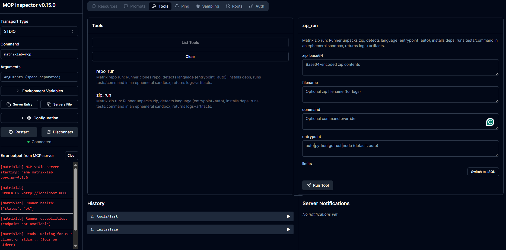

# 🧪 matrixlab

**Safety-first sandbox execution for agents, CI, and MCP tools**
Clone, unpack, install, build, and test **untrusted repositories or zip artifacts** inside **ephemeral, isolated containers** — the same execution model used by ChatGPT.

<p align="left">
  <a href="./LICENSE"></a>
  <a href="https://pypi.org/project/matrixlab/"></a>
  
  
</p>

> **matrixlab** is a production-grade **sandbox execution facility**.
> It exposes a **Runner API** and an **MCP stdio server** so humans, agents, and CI systems can safely run untrusted code with strong isolation guarantees.

---

## What is matrixlab?

**matrixlab** is a **controlled execution environment** that replicates the way ChatGPT executes code:

* Every run happens in a **fresh container**
* Nothing persists between runs
* The host filesystem is never exposed
* Output is collected as artifacts

It follows a strict **three-layer architecture**:

```
Agent / CI / MCP Host
        |
        v
   MCP Server (pip-installed, small)
        |
        v
   Runner API (Docker service)
        |
        v
   Ephemeral Sandbox Containers
```

---

## What matrixlab is (and is not)

### ✅ matrixlab **IS**

* A **sandbox execution backend**
* A **verification facility** for repos, MCP servers, agents, and tools
* A **ChatGPT-style runner** for:

  * GitHub / GitLab repositories
  * Uploaded ZIP files
  * Arbitrary build/test commands
* A **bridge** between MCP agents and Docker sandboxes

### ❌ matrixlab **IS NOT**

* A build cache
* A long-running environment
* A package manager
* A VM replacement

---

## Key features

### 🔒 Strong isolation by default

* Non-root user inside containers
* Read-only root filesystem
* Dropped Linux capabilities
* Per-step CPU / memory / PID limits
* Network disabled by default

### 📦 Ephemeral sandboxes

Each step runs in a **new container**:

* No shared state
* No cross-contamination
* Guaranteed cleanup

### 🧰 Prebuilt sandbox images

Ready-to-use, minimal images:

| Image                          | Purpose                                         |
| ------------------------------ | ----------------------------------------------- |
| `sandbox-utils`                | unzip, tar, file inspection, language detection |
| `sandbox-python`               | Python projects                                 |
| `sandbox-node`                 | Node.js / npm                                   |
| `sandbox-go`                   | Go modules                                      |
| `sandbox-rust`                 | Cargo / Rust                                    |
| *(optional)* Java, .NET, build |                                                 |

### 🔌 MCP stdio server

* Exposes tools like `repo_run(...)`
* Designed for **agent orchestration**
* Compatible with MCP Inspector and MCP hosts

---

## Installation (PyPI)

### 1️⃣ Install the MCP server

```bash
pip install matrixlab
```

This installs:

* `matrixlab-mcp` (stdio MCP server)
* `matrixlab-inspect` (JSON-RPC smoke inspector)

> ⚠️ This does **not** install Docker images.
> Docker images are runtime infrastructure, not Python dependencies.

---

## Runtime requirements

| Requirement        | Purpose             |
| ------------------ | ------------------- |
| Docker 24+         | Sandbox execution   |
| Docker Compose     | Local orchestration |
| Python 3.10+       | MCP server          |
| Node.js (optional) | Inspector UI        |

---

## Quickstart (local, production-like)

### 1️⃣ Start Runner + sandboxes

```bash
make run
```

Verify Runner health:

```bash
curl http://localhost:8000/health
# {"status":"ok"}
```

---

### 2️⃣ Run MCP server (stdio)

```bash
make mcp
```

Output goes to **stderr** (correct for MCP).

---

### 3️⃣ Inspect MCP server (CI-style)

```bash
make inspect
```

This verifies:

* `initialize`
* `tools/list`

---

### 4️⃣ Inspect MCP server (UI)

```bash
make inspector
```

This launches the official **MCP Inspector UI** and connects automatically.


---

## Example: run a GitHub repository

### Via MCP tool (agent / Inspector)

```json
{
  "name": "repo_run",
  "arguments": {
    "repo_url": "https://github.com/pallets/flask",
    "ref": "main"
  }
}
```

matrixlab will:

1. Clone the repo
2. Detect language
3. Choose sandbox
4. Install deps
5. Run tests
6. Return logs + artifacts

---

### Via HTTP (Runner API)

```bash
curl -X POST http://localhost:8000/run \
  -H "Content-Type: application/json" \
  -d @payload.json
```

---

## Example: unzip & test (ChatGPT-style)

The **Runner** (not the MCP server) handles ZIP execution:

1. Upload zip (base64)
2. Unpack inside `sandbox-utils`
3. Detect language
4. Run install/test pipeline
5. Collect `/output`

This exactly mirrors ChatGPT’s execution model.

---

## Security model

matrixlab enforces:

* 🔐 Non-root execution
* 📦 Read-only container filesystem
* 🚫 No network unless explicitly enabled
* 🧹 Guaranteed cleanup
* 📁 Controlled workspace + output mounts

> ⚠️ Local dev uses Docker socket mounting for convenience.
> **Production deployments should use**:
>
> * Dedicated executor hosts
> * Rootless Docker
> * gVisor / Kata
> * Kubernetes Jobs

---

## What happens between runs?

Nothing persists.

Each job:

* gets a new workspace
* runs in new containers
* is destroyed after completion

This enables **massive parallel testing** safely.

---

## Repository layout (source)

```text
matrixlab/
  matrixlab/          # MCP server (pip-installed)
  runner/             # FastAPI Runner (Docker)
  sandbox-utils/
  sandbox-python/
  sandbox-node/
  sandbox-go/
  sandbox-rust/
  orchestrator/       # Example client
  scripts/
  docker-compose.yml
  Makefile
```

---

## Make targets (summary)

```bash
make install        # install matrixlab (pip)
make run            # start runner + sandboxes
make mcp            # run MCP server
make inspect        # CI smoke check
make inspector  # interactive UI
make build-images   # build Docker images
make push-images    # publish images
```

---

## When should you use matrixlab?

Use matrixlab if you need to:

* Safely test **untrusted code**
* Validate **agent-generated repositories**
* Inspect **third-party MCP servers**
* Run CI-like workflows from agents
* Reproduce ChatGPT’s sandbox behavior

---

## License

Apache-2.0 — see `LICENSE`.

