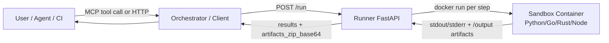

# 🧪 matrixlab

*Safety-first **sandbox verification** for the Agent-Matrix ecosystem — clone, install, test, and debug untrusted repos (agents/tools/MCP servers) inside ephemeral containers.*

<p align="left">
  <a href="./LICENSE"></a>
  <a href="https://github.com/agent-matrix/matrix-hub"></a>
  <a href="https://github.com/agent-matrix/matrix-architect"></a>
  
  
</p>

> **matrixlab** is the “verification facility” for Matrix Architect and other automation: it provides a secure **Runner API** and **MCP tool surface** to execute build/test plans in isolated sandboxes.

---

## What is matrixlab?

**matrixlab** is a controlled execution + verification facility used by higher-level systems (e.g., **Matrix Architect**) to safely **clone**, **install**, **test**, and **debug** untrusted repositories (agents/tools/**MCP servers**) inside **ephemeral sandboxes**.

It implements the proven **Orchestrator → Runner → Sandbox** pattern:

- **Orchestrator** decides *what* to do (plan, steps, retries).
- **Runner** executes *how* to do it (isolated containers per step).
- **Sandbox images** provide clean, language-specific runtimes.

---

## Why matrixlab

When you need to validate third-party code (or AI-generated code) you want:

- **Reproducible environments** (fresh container per step)
- **Strong isolation boundaries** (read-only rootfs, non-root user, dropped caps)
- **Evidence you can inspect** (stdout/stderr + output artifacts)
- **Automation-friendly interfaces** (HTTP + MCP tools)

matrixlab is designed for **safe automation**: it can be invoked by humans, CI pipelines, agents, or other services in the Matrix ecosystem.

---

## Key features

- **Runner (FastAPI)**  
  Executes job steps in short-lived Docker containers with safety defaults (non-root, read-only rootfs, limited resources).

- **Language-aware pipelines (Orchestrator example client)**  
  Deterministically detects repo language and selects the right sandbox image + install/test flow.

- **Sandbox images per language**  
  - Python
  - Go
  - Rust
  - Node.js

- **MCP stdio server**  
  Exposes tools (e.g., `repo_run(...)`) so MCP hosts/agents can trigger validation runs.

- **MCP Inspector**  
  Smoke-check utility that boots the MCP server and validates it responds to `initialize` and `tools/list`.

---

## Architecture



---

## Repository layout

```text
matrixlab/
  runner/               # FastAPI Runner service (HTTP /run)
  orchestrator/         # Example client + language detection + pipelines
  sandbox-python/       # Python sandbox runtime image
  sandbox-go/           # Go sandbox runtime image
  sandbox-rust/         # Rust sandbox runtime image
  sandbox-node/         # Node.js sandbox runtime image
  mcp/                  # MCP stdio server + inspector
  scripts/              # Convenience scripts
  docker-compose.yml
  Makefile
```

---

## Requirements

* Docker 24+ and Docker Compose plugin
* Python 3.10+ (for local MCP server + inspector tooling)
* `make`
* Optional: `jq` for nicer JSON output

---

## Quickstart (local)

### 1) Start Runner + sandbox images

```bash
make run
```

Check Runner health:

```bash
curl -s http://localhost:8000/health | jq
```

Expected:

```json
{ "status": "ok" }
```

### 2) Run the MCP server (stdio)

In another terminal:

```bash
make mcp
```

This starts the MCP stdio server locally and points it at the Runner via `RUNNER_URL` (default `http://localhost:8000`).

### 3) Inspect the MCP server

In a third terminal:

```bash
make inspect
```

The inspector will:

* start the MCP server as a subprocess
* call `initialize`
* call `tools/list`
* print responses and exit non-zero if something looks wrong

---

## Make targets

```bash
make help     # list commands
make install  # create .venv and install MCP deps
make run      # docker compose up -d --build (Runner + sandboxes)
make logs     # tail compose logs
make down     # stop stack
make mcp      # run MCP stdio server locally
make inspect  # run MCP inspector smoke check
make clean    # remove .venv
```

---

## Configuration

### Environment variables

* `RUNNER_URL` (default: `http://localhost:8000`)
  Where the MCP server / inspector calls the Runner.

Override example:

```bash
RUNNER_URL=http://127.0.0.1:8000 make mcp
```

---

## Runner API

### `POST /run`

Runner accepts a job description consisting of **steps**.

Each step includes:

* `name`
* `command` (executed via `bash -lc`)
* `timeout_seconds`
* `network`: `none` or `egress`

Runner returns:

* `results[]` with `exit_code`, `stdout`, `stderr` per step
* `artifacts_zip_base64`: a zipped `/output` directory produced by the job

This API is designed to be easy for orchestrators (human or AI) to call repeatedly.

---

## Language detection (Orchestrator)

matrixlab uses deterministic file-based detection (no LLM guessing):

* `go.mod` → Go
* `Cargo.toml` → Rust
* `package.json` → Node
* `pyproject.toml` / `requirements.txt` / `setup.py` → Python

This improves reproducibility and reduces hallucination risk.

---

## Security model (v1)

Runner launches sandbox containers with these defaults:

* Runs as non-root (uid 1000)
* Read-only root filesystem
* Drops Linux capabilities
* Resource limits (CPU / memory / pids)
* `/tmp` mounted as `tmpfs` with `noexec,nosuid`
* **Network disabled by default**

  * enable only for steps that require fetching (clone/install)

> Local development mounts Docker socket (`/var/run/docker.sock`) into the Runner container so it can launch sandbox containers.
> **Do not use this pattern in production.** Prefer a dedicated executor host, rootless Docker, gVisor, or Kubernetes Jobs with restricted permissions.

---

## Common workflows

### Validate a GitHub MCP server repo

* Use an MCP host → call `repo_run(repo_url, ref, command)`
* Or call Runner API directly via `/run`

### Integrate with Matrix Architect

Matrix Architect can treat matrixlab as:

* a verification facility for repos and MCP servers
* an evidence producer (logs + artifacts)
* a gating input before deploy/publish

---

## License

Apache-2.0 — see `LICENSE`.

