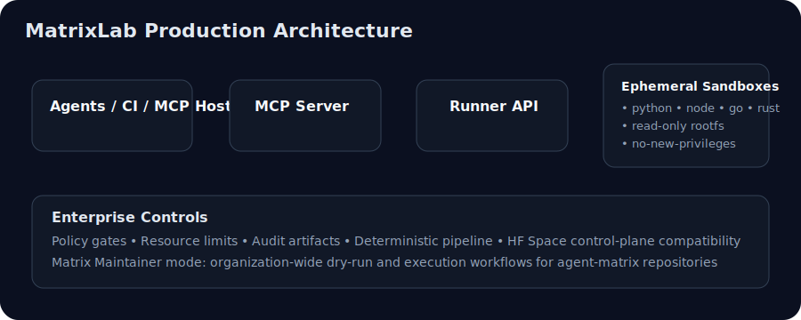

<p align="center">
  
</p>

<p align="center">
  <strong>Enterprise-grade, safety-first sandbox execution for agents, CI, and MCP tools.</strong>
</p>

<p align="center">
  <a href="./LICENSE"></a>
  <a href="https://pypi.org/project/matrixlab/"></a>
  
  
</p>

---

## Why MatrixLab

MatrixLab provides a production execution fabric for untrusted code and autonomous maintenance loops:

- **Isolated execution** in fresh, disposable containers
- **Policy-friendly defaults** (resource limits, restricted capabilities, network control)
- **MCP-ready integration** for agentic orchestration
- **Artifact-centric evidence** for compliance and debugging
- **HF Space control-plane compatibility** for remote repo maintenance

---

## Architecture (production model)

<p align="center">
  
</p>

Core execution chain:

1. Agent / CI / MCP Host
2. MatrixLab MCP server
3. Runner API
4. Ephemeral sandbox containers

Each run is stateless-by-default: no persistent host filesystem exposure, no cross-run contamination, and reproducible artifact output.

---

## What MatrixLab is (and is not)

### ✅ MatrixLab **is**

- A secure sandbox execution backend
- A repo verification and maintenance execution engine
- A bridge from MCP workflows to Docker-isolated runtime
- A practical backend for HF Space-triggered maintenance loops

### ❌ MatrixLab **is not**

- A VM replacement
- A package manager
- A long-lived mutable development shell

---

## Core capabilities

- **Sandbox images:** utils, python, node, go, rust (+ optional java, dotnet, build)
- **Runner API:** health/capabilities/run plus environment lifecycle endpoints
- **MCP server tools:** repository run, zip run, detect stack, artifact utilities
- **Environment lifecycle:** bootstrap cache + task execution on branch
- **HF backend APIs:** profile-driven repo runs (`/repo/run`) for remote operations

---

## Quickstart

### 1) Install

```bash
pip install matrixlab
```

### 2) Start local runtime

```bash
make run
curl http://localhost:8000/health
```

### 3) Run MCP server

```bash
make mcp
```

### 4) Validate MCP server

```bash
make inspect
```

---

## Make targets (enterprise workflow)

```bash
make install              # install matrixlab (pip editable in venv)
make test                 # compile + route smoke checks
make run                  # start runner + sandboxes
make mcp                  # run MCP stdio server
make inspect              # MCP initialize/tools smoke check
make inspector            # MCP Inspector UI launcher
make hf-build             # build HF Space image from hf/
make hf-deploy-tree       # clean deploy tree in .dist/hf-space
make matrix-maintain-plan # dry-run org maintenance payloads
make matrix-maintain-run  # execute org maintenance via HF backend
make build-images         # build container images
make push-images          # push images to registry
```

---

## Hugging Face Space backend mode

`hf/` is a production control-plane app that delegates execution to MatrixLab Runner.

Flow:

1. Deploy `hf/` as a Hugging Face Space
2. Set `MATRIXLAB_RUNNER_URL`
3. Call `POST /repo/run` with profile/custom repo details
4. Runner bootstraps cache + executes task in sandbox

Built-in profile compatibility:

- `https://github.com/ruslanmv/gitpilot`
- `https://github.com/ruslanmv/agent-generator`
- `https://github.com/ruslanmv/RepoGuardian`

For full API examples and runtime variables, see `hf/README.md`.

---

## Matrix Maintainer mode (Agent-Matrix org operations)

MatrixLab can act as the execution backbone for `matrix-maintainer` style loops across `https://github.com/agent-matrix`.

Included assets:

- `configs/agent_matrix_repos.json` — canonical maintenance repo manifest
- `tools/matrix_maintainer.py` — dry-run planner and optional executor (`--execute`)
- `.github/workflows/matrix-maintainer-health.yml` — scheduled dry-run + manual execute

### Example

```bash
make matrix-maintain-plan MATRIXLAB_HF_URL=https://your-hf-space-url
make matrix-maintain-run  MATRIXLAB_HF_URL=https://your-hf-space-url
```

Design principle: **non-destructive by default** (plan first, execute explicitly).

---

## Production deployment notes

- Use dedicated executor hosts for Runner workloads
- Apply network segmentation and secret isolation
- Put authentication + rate limiting in front of HF `/repo/run`
- Keep human approval gates in higher-level governance systems
- Store artifacts for audit and rollback evidence

---

## License

Apache-2.0 — see `LICENSE`.
